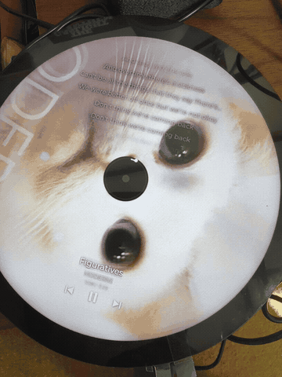

# Spotify Circular Display

A vinyl-inspired Spotify player for circular screens, built for the Raspberry Pi. Album artwork fills a spinning vinyl record with grooves, a center label with a circular progress ring, synced scrolling lyrics, and track info — all rendered in the browser at 60fps.

**Zero-config for guests** — anyone on your network can open Spotify, select "Pi Display", and their music appears on the display. No login or authentication required.

<p align="center">
  
</p>

## Features

- **Zero-config playback** — No OAuth login needed. Anyone on the network selects "Pi Display" in Spotify and it just works
- **Spinning vinyl record** — Album art fills a rotating platter at 33&#8531; RPM with smooth CSS GPU-accelerated animation
- **Eased spin-up/spin-down** — 4-second cubic ease-in-out ramp when playback starts/stops, with return-to-zero when paused
- **Vinyl grooves** — Canvas-rendered concentric groove lines overlaid on the artwork
- **Circular progress ring** — Canvas arc on the center label with an animated dot tip, warm-to-white gradient
- **Synced scrolling lyrics** — Time-synced lyrics from LRCLIB scroll in the top half of the display, with the active line highlighted
- **Track info** — Song title, artist name, and elapsed/remaining time
- **QR code on idle** — When music pauses for 30+ seconds, a scannable QR code appears linking to connection instructions
- **Spotify Connect** — Acts as a Spotify Connect speaker via Raspotify
- **GPIO volume buttons** — Physical buttons for volume up/down via amixer (optional)
- **Auto-start kiosk** — Boots straight into fullscreen Chromium displaying the player
- **1080x1080** — Designed specifically for square/circular displays

## How It Works (For Users)

1. **Open Spotify** on your phone or computer
2. **Tap the devices icon** (bottom of now-playing screen)
3. **Select "Pi Display"**
4. **Play music** — the display shows your artwork, lyrics, and progress instantly

That's it. No accounts to create, no QR codes to scan, no passwords. If the display is idle, a QR code appears linking to a simple instruction page.

## Hardware

| Component | Recommended |
|-----------|------------|
| **Single-board computer** | Raspberry Pi 5 (4GB+) |
| **Display** | 1080x1080 circular HDMI display |
| **Audio** | Built-in audio jack, USB DAC, or HDMI audio |
| **Buttons** (optional) | Momentary push buttons wired to GPIO |

> **Note:** A Pi 4 (2GB+) or Pi 5 is recommended for smooth Chromium rendering. A pygame-based fallback (`display.py`) is included for lower-powered devices.

## Architecture

```
┌─────────────────────────────────────────────────┐
│  Any Spotify App (phone/computer)               │
│  Select "Pi Display" as output device           │
└──────────────┬──────────────────────────────────┘
               │ Spotify Connect
┌──────────────▼──────────────────────────────────┐
│  Raspberry Pi                                   │
│                                                 │
│  ┌─────────────┐                                │
│  │ Raspotify   │── onevent.sh ──► state.json    │
│  │ (audio out) │   (track ID, position, volume) │
│  └─────────────┘                                │
│                   ┌──────────────────────────┐  │
│                   │ Flask Server (server.py)  │  │
│    state.json ──► │ - Reads local state       │  │
│                   │ - Track metadata lookup   │  │
│                   │   (client credentials)    │  │
│                   │ - Lyrics proxy (LRCLIB)   │  │
│                   │ - Serves web UI           │  │
│                   └──────────┬───────────────┘  │
│                              │ localhost:5000    │
│  ┌───────────────────────────▼───────────────┐  │
│  │ Chromium Kiosk (fullscreen)               │  │
│  │ - HTML/CSS/JS vinyl display               │  │
│  │ - 60fps CSS rotation                      │  │
│  │ - Canvas progress ring                    │  │
│  │ - Synced lyrics                           │  │
│  └───────────────────────────────────────────┘  │
│                                                 │
│  ┌───────────────────────────────────────────┐  │
│  │ GPIO Buttons (optional)                   │  │
│  │ BCM 23=vol-, 24=vol+ (via amixer)         │  │
│  └───────────────────────────────────────────┘  │
└─────────────────────────────────────────────────┘
```

### How metadata works without user login

1. **Raspotify** receives audio via Spotify Connect and fires `--onevent` on each playback event
2. **`onevent.sh`** captures the track ID, position, duration, and volume, writing them to `/tmp/spotify-state.json`
3. **Flask server** reads this state file and uses the Spotify **client credentials** flow (app-level token — no user login) to look up track metadata (name, artist, album, artwork) via `GET /v1/tracks/{id}`
4. **Frontend** polls `/api/now-playing` every 2 seconds and renders the vinyl display

## Quick Start

### 1. Clone the repository

```bash
git clone https://github.com/nonlineartom/spotify-circular-display.git
cd spotify-circular-display
```

### 2. Create a Spotify App

1. Go to the [Spotify Developer Dashboard](https://developer.spotify.com/dashboard)
2. Create a new app
3. Note your **Client ID** and **Client Secret**

> No redirect URI needed — this system uses client credentials only.

### 3. Configure

```bash
cp config.example.json config.json
```

Edit `config.json` with your Spotify app credentials:

```json
{
  "client_id": "YOUR_SPOTIFY_CLIENT_ID",
  "client_secret": "YOUR_SPOTIFY_CLIENT_SECRET"
}
```

### 4. Deploy to Raspberry Pi

Copy the project to your Pi and run the setup script:

```bash
scp -r . admin@your-pi-ip:~/circle-pi-display/
ssh admin@your-pi-ip
cd ~/circle-pi-display
chmod +x setup.sh
./setup.sh
```

The setup script will:
- Install system dependencies (Python, Chromium, unclutter)
- Install and configure Raspotify as a Spotify Connect receiver with onevent handler
- Create a Python virtual environment and install packages
- Prompt for Spotify API credentials (if not already in config.json)
- Install systemd services for auto-start
- Configure HDMI output for 1080x1080

### 5. Reboot and enjoy

```bash
sudo reboot
```

After reboot, open Spotify on your phone, select **"Pi Display"** as the output device, and play music. The display updates instantly.

## Systemd Services

| Service | Description |
|---------|------------|
| `spotify-display` | Flask server — metadata lookup and web UI |
| `spotify-kiosk` | Chromium in fullscreen kiosk mode |
| `spotify-buttons` | GPIO button handler (optional) |
| `spotify-network-watchdog` | Restarts Spotify services after Wi-Fi returns |
| `raspotify` | Spotify Connect audio receiver + onevent |

Useful commands:

```bash
sudo systemctl status spotify-display
sudo systemctl restart spotify-kiosk
sudo journalctl -u spotify-display -f
sudo journalctl -u raspotify -f
curl http://localhost:5000/api/health
```

## Display Configuration

The setup script configures HDMI for a 1080x1080 square display. If your display has different specs, edit `/boot/firmware/config.txt`:

```ini
hdmi_force_hotplug=1
hdmi_group=2
hdmi_mode=87
hdmi_cvt=1080 1080 60 1 0 0 0
```

## GPIO Pinout (optional)

Wire momentary buttons between these BCM GPIO pins and GND:

| Pin | Function |
|-----|----------|
| 23 | Volume down (amixer) |
| 24 | Volume up (amixer) |

> Play/pause, next, and previous buttons (pins 17, 22, 27) are wired but require MPRIS support — a future enhancement.

Internal pull-up resistors are enabled — no external resistors needed.

## Tech Stack

- **Backend:** Python / Flask — local state reader, Spotify client credentials for metadata, LRCLIB lyrics proxy
- **Metadata:** Raspotify `--onevent` handler writes playback state; Flask reads it and enriches with Spotify track API
- **Frontend:** Vanilla HTML/CSS/JS — no build tools or frameworks
- **Animation:** CSS `transform: rotate()` with `will-change` for GPU compositing
- **Progress:** Canvas-based circular arc with warm-to-white gradient
- **Lyrics:** [LRCLIB](https://lrclib.net) — free time-synced lyrics API
- **Audio:** [Raspotify](https://github.com/dtcooper/raspotify) (librespot-based Spotify Connect)
- **Fonts:** [Montserrat](https://fonts.google.com/specimen/Montserrat) via Google Fonts

## License

MIT
