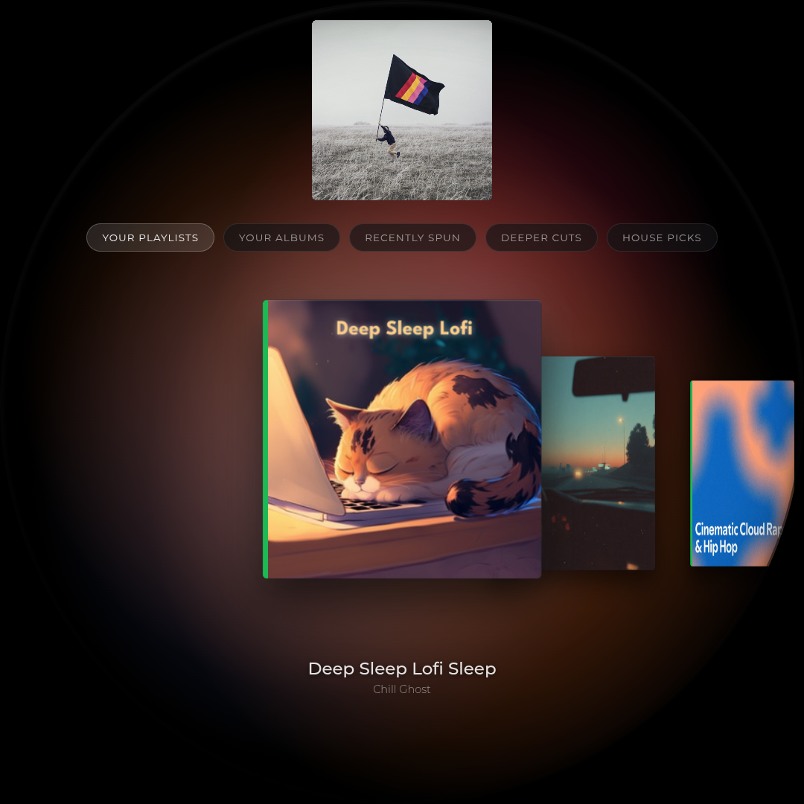
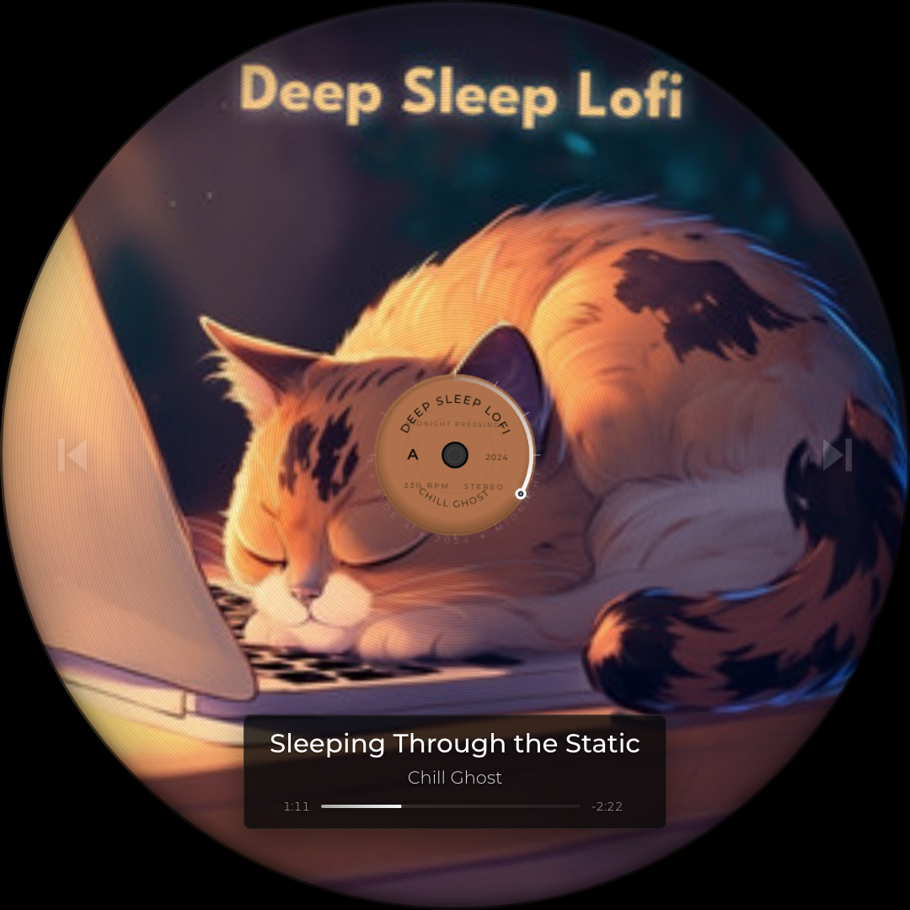
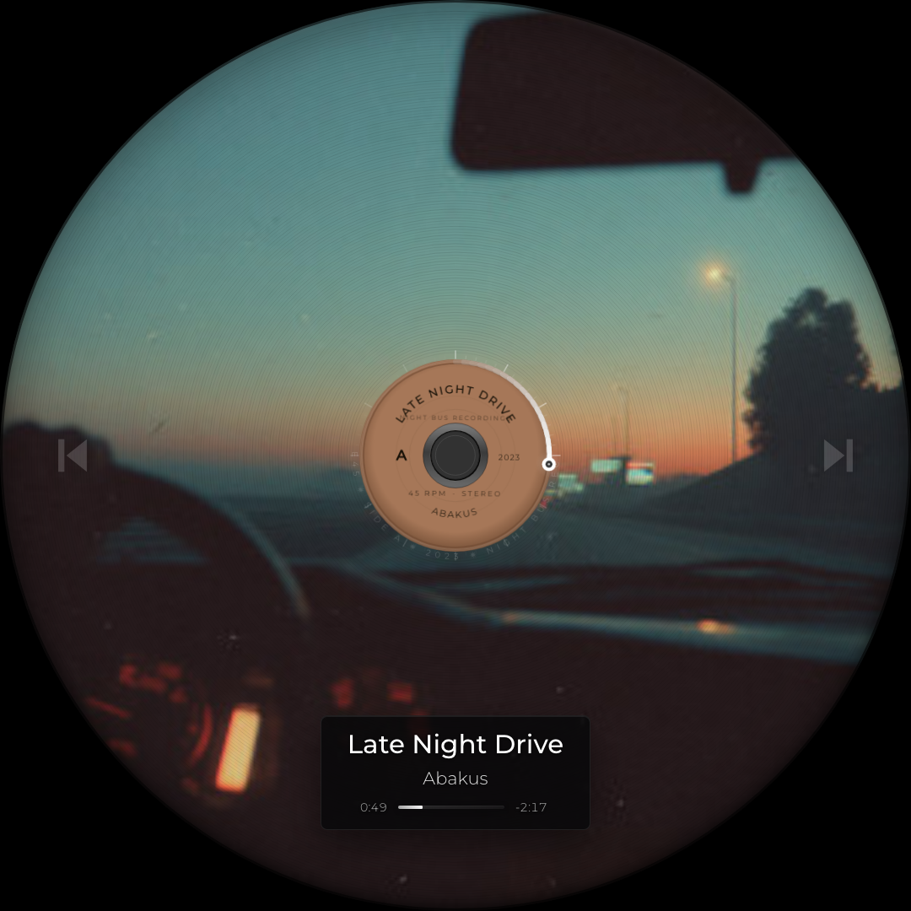
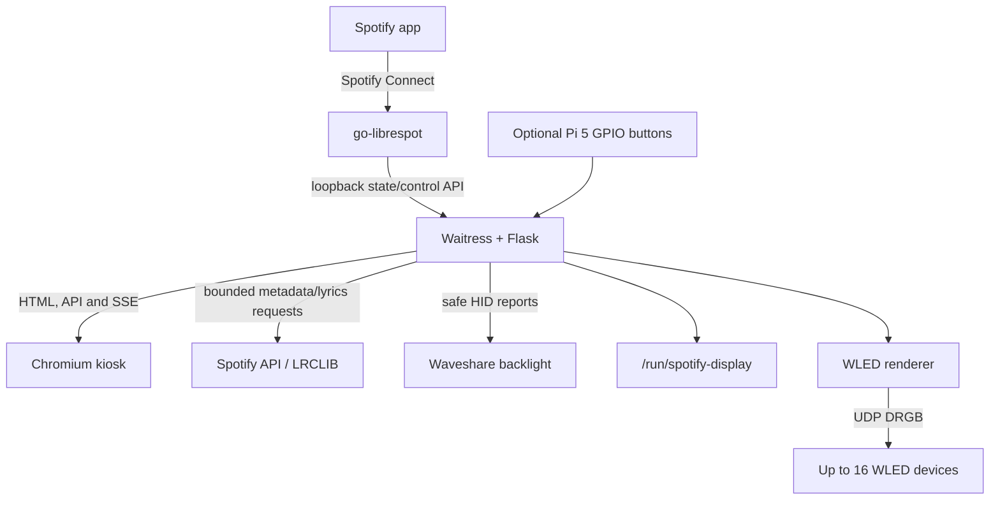

# Spotify Circular Display

A 1080 x 1080 vinyl-inspired Spotify Connect display for Raspberry Pi. Album
art becomes a spinning record with procedural labels, grooves, progress,
lyrics, a browsable record crate, synchronized WLED lighting and physical
multi-touch controls.

Spotify Connect playback remains zero-configuration: a guest selects **Pi
Display** in Spotify and the screen follows their music. OAuth is optional and
is used only for an owner-approved, time-limited personalized crate.

<p align="center">
  
</p>

| The Crate | The Pressing | 45 Mode |
|:--:|:--:|:--:|
|  |  |  |
| Browse saved and curated records | Artwork-derived labels and colour | Conservative single/EP detection |

## Highlights

- Delta-time 33⅓/45 RPM rotation with four-second motor ramps, artwork flips,
  return-to-zero pause and frame-time-based quality reduction.
- Single-, two- and three-finger gestures for skip, pause, seek, volume, crate,
  tracklist and hardware display brightness.
- Versioned artwork/palette loading, server-sent playback signals and a
  non-overlapping polling fallback that preserves the last valid state through
  brief outages.
- Synced LRCLIB lyrics with bounded caching, correct fractional LRC timestamps,
  offsets, multiple timestamps and explicit loading/error states.
- A bounded, lazy-loaded private/house record crate and album track picker.
- WLED rendering at vinyl speed with smooth pause ramp, failure grace, bounded
  configuration and per-device direction, phase, brightness and gamma.
- Owner-approved Spotify pairing with OAuth state, PKCE, one-use links and
  expiring guest library grants.
- Hidden diagnostics (`D` or `?diag=1`) for browser timing, transport, receiver,
  crate, WLED, lyrics, temperature, load and disk state.
- Reduced-motion, keyboard, semantic-control and modal focus support.
- A repaired low-rate Pygame fallback for systems that cannot run Chromium.

## Controls

| Input | Action |
|---|---|
| Center tap / Space | Play or pause |
| Left/right edge tap, swipe or arrow key | Previous/next |
| Two-finger twist | Seek; one full turn is 60 seconds |
| Two-finger vertical drag | Playback volume |
| Two-finger tap | Play or pause |
| Pinch in | Open/close the record crate |
| Pinch out | Open the current album tracklist |
| Three-finger vertical drag | Hardware panel brightness |
| `D` | Toggle diagnostics |
| Escape | Close the active modal, tracklist or crate |

The compositor must deliver native multi-touch pointer events. See
[TROUBLESHOOTING.md](TROUBLESHOOTING.md) if gestures arrive as a single mouse
pointer.

## Architecture


```mermaid
flowchart TD
    spotify["Spotify app"] -->|"Spotify Connect"| receiver["go-librespot"]
    receiver -->|"loopback state/control API"| server["Waitress + Flask"]
    server -->|"HTML, API and SSE"| kiosk["Chromium kiosk"]
    server -->|"bounded metadata/lyrics requests"| external["Spotify API / LRCLIB"]
    server -->|"safe HID reports"| panel["Waveshare backlight"]
    server --> state["/run/spotify-display"]
    server --> wled["WLED renderer"]
    wled -->|"UDP DRGB"| strips["Up to 16 WLED devices"]
    buttons["Optional Pi 5 GPIO buttons"] --> server
```

The primary playback path is local. The old Raspotify event file is supported
only as an explicitly installed legacy fallback. Browser playback updates are
normally signalled by `/api/events`; a 2-second single-flight poll takes over if
SSE is unavailable.

## Trust model

The project is a home-LAN appliance, not an Internet-facing service.

- Public LAN routes expose now-playing state and intentional playback controls.
- Private crate data, OAuth administration, WLED configuration and detailed
  diagnostics require the loopback kiosk or owner authorization.
- A remote owner can authenticate with `Authorization: Bearer`,
  `X-Owner-Token`, or `POST /api/auth/owner` when `OWNER_TOKEN` or
  `security.owner_token` is configured.
- Browser mutations enforce same-origin checks and bounded rate limits.
- Do not port-forward the Flask/Waitress port. Use HTTPS and one configured
  public origin for any remote OAuth callback.

See [docs/SECURITY.md](docs/SECURITY.md) for the full boundary and
[docs/REMEDIATION.md](docs/REMEDIATION.md) for the audit implementation record.

## Hardware

| Component | Recommended |
|---|---|
| Computer | Raspberry Pi 5, 4 GB+, 64-bit Raspberry Pi OS |
| Display | Waveshare 7inch 1080 x 1080 HDMI Round |
| Touch/backlight USB | `0712:000a` Waveshare controller |
| Audio | HDMI audio or a USB DAC |
| Lighting | Optional WLED/WS2812 strip or bar |
| Buttons | Optional momentary GPIO buttons |

Raspberry Pi 5 has no built-in analogue audio jack. The browser renderer is the
primary mode; `display.py` is a deliberately simpler fallback.

The supplied backlight policy is conservative for the existing 3 A
installation: logical 0–100 maps to at most 80% physical output and every
startup, reconnect, idle and wake transition ramps through ten-point steps. If
USB over-current or touch reconnection appears in `dmesg`, power the panel from
its dedicated input or use a correctly detected Pi 5 5 A supply.

## Installation

### 1. Configure Spotify metadata access

Create an application in the Spotify Developer Dashboard, then:

```bash
git clone https://github.com/nonlineartom/spotify-circular-display.git
cd spotify-circular-display
cp config.example.json config.json
chmod 600 config.json
```

Set `client_id` and `client_secret` in `config.json`. These application
credentials enrich metadata and album tracklists; guests do not log in to play
music.

### 2. Install the candidate on the Pi

```bash
chmod +x setup.sh
INSTALL_TEST_DEPS=1 ./setup.sh
```

`INSTALL_TEST_DEPS=1` adds hash-locked pytest dependencies and Node.js so the
full release gate can run on the appliance; they consume disk only and are not
loaded by production services. Omit it for a minimal install after an already
validated release. By default setup installs and enables candidate units but
does not reboot or stop the running receiver/kiosk. On an existing appliance,
use `STAGED_INSTALL=1`: it preserves service enablement, graphical-session
links, Wi-Fi settings and display power policy until the documented cutover.

### 3. Validate before reboot/cutover

For an audited install, run:

```bash
bash scripts/validate.sh
sudo systemd-analyze verify \
  /etc/systemd/system/go-librespot.service \
  /etc/systemd/system/spotify-display.service \
  /etc/systemd/system/spotify-network-watchdog.service \
  /etc/systemd/system/spotify-wled.service \
  /etc/systemd/system/spotify-wled.path
sudo reboot
```

The validation script automatically uses `venv/bin/python` when setup has
created it. It compiles Python, runs the regression suite, checks project shell
scripts and embedded JavaScript, and renders every service/path/tmpfiles
template. Follow [docs/DEPLOYMENT.md](docs/DEPLOYMENT.md) instead of rebooting
immediately when upgrading a live installation.

The installer:

- verifies the go-librespot v0.7.4 archive and pip bootstrap checksums;
- installs the hash-locked Python environment from `requirements.lock`;
- optionally installs the separately hash-locked release-test toolchain;
- merges credentials without replacing existing WLED/security settings;
- renders hardened system services for the actual user, path and port;
- installs the Chromium or Pygame graphical user service;
- creates the shared `/run/spotify-display` runtime directory;
- installs exact-device HID permissions for the Waveshare backlight;
- enables cheap path activation for optional WLED;
- hardens NetworkManager recovery without killing unrelated desktop processes;
- leaves GPIO and Raspotify disabled unless explicitly requested.

Useful installer options:

```bash
ENABLE_GPIO_BUTTONS=1 ./setup.sh       # buttons are wired
DISPLAY_BACKEND=pygame ./setup.sh      # lightweight renderer
DISPLAY_PORT=5050 ./setup.sh           # non-default HTTP port
INSTALL_TEST_DEPS=1 ./setup.sh         # pytest + Node release gate
STAGED_INSTALL=1 ./setup.sh            # preserve live service/host policy state
```

Raspotify fallback installation is deliberately opt-in and requires the
operator to provide the expected installer checksum.

Read [docs/DEPLOYMENT.md](docs/DEPLOYMENT.md) before upgrading a running Pi; it
contains staged rollout and rollback instructions.

## Services

| Unit | Role |
|---|---|
| `go-librespot.service` | Spotify Connect receiver and audio |
| `spotify-display.service` | Waitress/Flask API and web assets |
| `spotify-kiosk.service` | Chromium graphical user service |
| `spotify-pygame.service` | Alternative graphical user service |
| `spotify-network-watchdog.service` | Debounced link recovery |
| `spotify-wled.path` | Activates WLED when configuration changes |
| `spotify-wled.service` | Optional LED renderer |
| `spotify-buttons.service` | Optional non-root Pi 5 GPIO handler |

Common diagnostics:

```bash
curl -i http://127.0.0.1:5000/api/health
curl -i http://127.0.0.1:5000/api/now-playing
sudo systemctl status spotify-display go-librespot spotify-wled
sudo journalctl -u spotify-display -u go-librespot -u spotify-wled -n 200 --no-pager
```

The kiosk units live in the graphical user's systemd manager:

```bash
systemctl --user status spotify-kiosk
systemctl --user restart spotify-kiosk
```

## Optional personalized crate and pairing

Playback needs no OAuth. To expose a Spotify account's private playlists and
saved albums in the shared crate, use one HTTPS origin for both the display and
callback, and register that exact callback with Spotify:

```json
{
  "public_base_url": "https://display.example",
  "redirect_uri": "https://display.example/callback",
  "guest_session_hours": 12,
  "security": {
    "owner_token": "GENERATE_A_LONG_RANDOM_TOKEN"
  }
}
```

Generate a token with `python3 -c 'import secrets; print(secrets.token_urlsafe(32))'`.
`config.json` must remain mode `0600`.

Until the optional graphical owner page is added, a remote owner can mint and
share a one-use, ten-minute guest pairing URL with:

```bash
BASE=https://display.example
curl -sS -c /tmp/display-owner.cookie \
  -H 'Content-Type: application/json' \
  --data '{"token":"YOUR_OWNER_TOKEN"}' \
  "$BASE/api/auth/owner"
curl -sS -b /tmp/display-owner.cookie -X POST "$BASE/api/auth/pairing"
rm -f /tmp/display-owner.cookie
```

Consuming the URL permits exactly one guest OAuth initiation within five
minutes. The resulting shared grant expires after 12 hours by default and
replaces the preceding personalized account. Disconnect with
`POST /api/auth/disconnect` from an owner session.

## Hardware backlight

Three-finger vertical drag controls the real backlight on the exact
`0712:000a` Waveshare controller. The backend discovers its current hidraw node,
accepts no raw HID input through HTTP, limits physical brightness, serializes
writes and rediscovers after USB re-enumeration. Idle lowers both pixels and
backlight; the first touch restores the active setting without activating a
control underneath.

The policy lives in `config.json`:

```json
"backlight": {
  "enabled": true,
  "initial_percent": 100,
  "idle_percent": 10,
  "safe_max_percent": 80,
  "ramp_interval_ms": 150,
  "retry_interval_seconds": 2
}
```

See [TROUBLESHOOTING.md](TROUBLESHOOTING.md) for the report format, permissions
and power diagnostics.

## WLED

The kiosk requests WLED discovery only while idle. Its single-flight scanner is
dormant without recent setup demand, caps each LAN batch at 512 total probes and
retains a short TTL cache. Configuration accepts at most 16 devices and 2,048
pixels per device. The renderer distinguishes active, genuine idle and temporary
backend failure; brief failures retain the last frame, while real idle releases
WLED realtime mode.

```json
"wled": {
  "enabled": true,
  "devices": [
    {
      "host": "192.168.1.67",
      "name": "Record halo",
      "pixel_count": 120,
      "reverse": false,
      "phase_offset": 0.0,
      "brightness": 0.8,
      "gamma": 1.0
    }
  ],
  "palette_colors": 3,
  "saturation_boost": 1.3,
  "gradient_drift_seconds": 1.8,
  "dim_band_width": 3,
  "play_fps": 30,
  "pause_fps": 1,
  "pause_release_seconds": 60,
  "realtime_timeout_seconds": 2
}
```

Per-device bounds are `phase_offset` -1..1 turns, `brightness` 0.05..1 and
`gamma` 0.5..3. The service builds one frame per unique rendering shape, not
once per identical strip. Runtime health is published atomically as schema v1
at `/run/spotify-display/wled-status.json`.

## GPIO

`rpi-lgpio` provides Pi 5-compatible RPi.GPIO semantics. Buttons are wired from
BCM pin to ground with internal pull-ups:

| BCM | Action |
|---:|---|
| 17 | Previous |
| 27 | Play/pause |
| 22 | Next |
| 23 | Volume down |
| 24 | Volume up |

All actions go through the local receiver API; no hard-coded ALSA `Master`
control is used.

## Development and verification

```bash
# after setup, or in an environment containing both lock files:
venv/bin/python -m pytest -q
venv/bin/python scripts/check_inline_js.py templates/index.html templates/join.html templates/connect.html
./scripts/validate.sh
```

For deterministic browser checks without a Spotify account or receiver:

```bash
MOCK_DISPLAY_PORT=5105 python3 scripts/run_mock_display.py
# open http://127.0.0.1:5105/?diag=1 at a 1080 x 1080 viewport
curl -X POST http://127.0.0.1:5105/__mock/state/next
curl -X POST http://127.0.0.1:5105/__mock/state/idle
```

Fixture states are `playing`, `paused`, `next`, `noart`, `badart`, `idle` and
`error`.
This harness is development-only and deliberately uses Flask's loopback
development server; production continues to use Waitress via `serve.sh`.

CI runs the hash-locked runtime plus `requirements-test.lock` on Python 3.11
and 3.13. Update `requirements.lock` with pip-tools only when intentionally
changing `requirements.txt`; update the small test lock when changing pytest,
and review every transitive/hash change.

The remaining target-only acceptance checks are recorded in
[docs/DEPLOYMENT.md](docs/DEPLOYMENT.md): systemd parsing, actual HID/GPIO/WLED,
network recovery, 1080 x 1080 frame timing, thermals and throttling.

## Further documentation

- [Audit remediation and residual work](docs/REMEDIATION.md)
- [Security and trust model](docs/SECURITY.md)
- [Deployment and rollback](docs/DEPLOYMENT.md)
- [Troubleshooting](TROUBLESHOOTING.md)
- [Case design](CASE_DESIGN.md)
- [Changelog](CHANGELOG.md)
