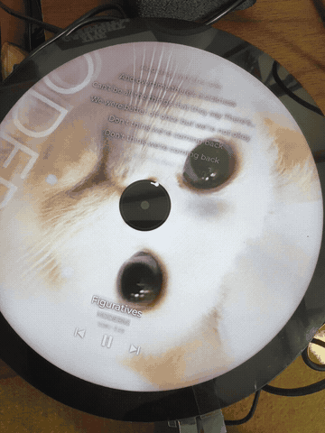

# Spotify Circular Display

A vinyl-inspired Spotify player for circular screens, built for the Raspberry Pi. Album artwork fills a spinning vinyl record with grooves, a center label with a circular progress ring, synced scrolling lyrics, and track info — all rendered in the browser at 60fps.

**Zero-config for guests** — anyone on your network can open Spotify, select "Pi Display", and their music appears on the display. No login or authentication required.

<p align="center">
  
</p>

## Features

- **Zero-config playback** — No OAuth login needed. Anyone on the network selects "Pi Display" in Spotify and it just works
- **Local touch controls** — Swipe/tap controls go through the on-device Spotify Connect receiver, not a personal Spotify Web API token
- **Spinning vinyl record** — Album art fills a rotating platter at 33&#8531; RPM with smooth CSS GPU-accelerated animation
- **Eased spin-up/spin-down** — 4-second cubic ease-in-out ramp when playback starts/stops, with return-to-zero when paused
- **Vinyl grooves** — Canvas-rendered concentric groove lines overlaid on the artwork
- **Circular progress ring** — Canvas arc on the center label with an animated dot tip, warm-to-white gradient
- **Synced scrolling lyrics** — Time-synced lyrics from LRCLIB scroll in the top half of the display, with the active line highlighted
- **Track info** — Song title, artist name, and elapsed/remaining time
- **Premium transitions** — Track skips flip the record, metadata crossfades, and the bottom time bar updates smoothly
- **Screen dimmer** — Fades to near-black after extended idle to protect the display
- **Spotify Connect** — Acts as a Spotify Connect speaker via go-librespot, with Raspotify kept as a fallback
- **GPIO volume buttons** — Physical buttons for volume up/down via amixer (optional)
- **Auto-start kiosk** — Boots straight into fullscreen Chromium displaying the player
- **1080x1080** — Designed specifically for square/circular displays

## How It Works (For Users)

1. **Open Spotify** on your phone or computer
2. **Tap the devices icon** (bottom of now-playing screen)
3. **Select "Pi Display"**
4. **Play music** — the display shows your artwork, lyrics, and progress instantly

That's it. No accounts to create, no QR codes to scan, no passwords.

## Hardware

| Component | Recommended |
|-----------|------------|
| **Single-board computer** | Raspberry Pi 5 (4GB+) |
| **Display** | 1080x1080 circular HDMI display |
| **Audio** | Built-in audio jack, USB DAC, or HDMI audio |
| **Buttons** (optional) | Momentary push buttons wired to GPIO |

> **Note:** A Pi 4 (2GB+) or Pi 5 is recommended for smooth Chromium rendering. A pygame-based fallback (`display.py`) is included for lower-powered devices.

## Architecture

```
┌─────────────────────────────────────────────────┐
│  Any Spotify App (phone/computer)               │
│  Select "Pi Display" as output device           │
└──────────────┬──────────────────────────────────┘
               │ Spotify Connect
┌──────────────▼──────────────────────────────────┐
│  Raspberry Pi                                   │
│                                                 │
│  ┌─────────────┐                                │
│  │go-librespot │── local API ─► playback state  │
│  │ (audio out) │   (track, position, controls)  │
│  └─────────────┘                                │
│                   ┌──────────────────────────┐  │
│                   │ Flask Server (server.py)  │  │
│  localhost:3678 ► │ - Reads local state       │  │
│                   │ - Track metadata lookup   │  │
│                   │   (client credentials)    │  │
│                   │ - Lyrics proxy (LRCLIB)   │  │
│                   │ - Serves web UI           │  │
│                   └──────────┬───────────────┘  │
│                              │ localhost:5000    │
│  ┌───────────────────────────▼───────────────┐  │
│  │ Chromium Kiosk (fullscreen)               │  │
│  │ - HTML/CSS/JS vinyl display               │  │
│  │ - 60fps CSS rotation                      │  │
│  │ - Canvas progress ring                    │  │
│  │ - Synced lyrics                           │  │
│  └───────────────────────────────────────────┘  │
│                                                 │
│  ┌───────────────────────────────────────────┐  │
│  │ GPIO Buttons (optional)                   │  │
│  │ BCM 23=vol-, 24=vol+ (via amixer)         │  │
│  └───────────────────────────────────────────┘  │
└─────────────────────────────────────────────────┘
```

### How metadata works without user login

1. **go-librespot** receives audio via Spotify Connect and exposes local playback state/control endpoints on `127.0.0.1:3678`
2. **Flask server** reads the local receiver API first, falling back to the old Raspotify `/tmp/spotify-state.json` event file on older installs
3. **Touch controls** call the local receiver through Flask, so skip/pause does not need per-user Spotify Web API OAuth
4. **Frontend** polls `/api/now-playing` every 2 seconds and renders the vinyl display

## Quick Start

### 1. Clone the repository

```bash
git clone https://github.com/nonlineartom/spotify-circular-display.git
cd spotify-circular-display
```

### 2. Create a Spotify App

1. Go to the [Spotify Developer Dashboard](https://developer.spotify.com/dashboard)
2. Create a new app
3. Note your **Client ID** and **Client Secret**

> No redirect URI is needed for the main display controls. OAuth is only needed
> if you enable the optional phone sign-in / personalized playlist flow.

### 3. Configure

```bash
cp config.example.json config.json
```

Edit `config.json` with your Spotify app credentials:

```json
{
  "client_id": "YOUR_SPOTIFY_CLIENT_ID",
  "client_secret": "YOUR_SPOTIFY_CLIENT_SECRET",
  "public_base_url": "",
  "redirect_uri": ""
}
```

For optional Spotify sign-in, Spotify requires the redirect URI sent by the app
to exactly match a URI in the Spotify Developer Dashboard. Set one of these:

- `redirect_uri`: exact full callback URI, for example `https://your-domain.example/callback`
- `public_base_url`: base URL for the display, used to build `/callback` and `/join`

Spotify currently requires HTTPS for non-loopback redirects. A plain LAN URL
like `http://192.168.68.80:5000/callback` may be rejected for newly created
Spotify apps. Use an HTTPS tunnel/domain for phone sign-in, or leave OAuth off
and keep using the zero-config local Spotify Connect controls.

### 4. Deploy to Raspberry Pi

Copy the project to your Pi and run the setup script:

```bash
scp -r . admin@your-pi-ip:~/circle-pi-display/
ssh admin@your-pi-ip
cd ~/circle-pi-display
chmod +x setup.sh
./setup.sh
```

The setup script will:
- Install system dependencies (Python, Chromium, unclutter)
- Install and configure go-librespot as the primary Spotify Connect receiver
- Install Raspotify as a disabled fallback receiver for older setups
- Create a Python virtual environment and install packages
- Prompt for Spotify API credentials (if not already in config.json)
- Install systemd services for auto-start
- Configure HDMI output for 1080x1080

### 5. Reboot and enjoy

```bash
sudo reboot
```

After reboot, open Spotify on your phone, select **"Pi Display"** as the output device, and play music. The display updates instantly.

## Systemd Services

| Service | Description |
|---------|------------|
| `spotify-display` | Flask server — metadata lookup and web UI |
| `spotify-kiosk` | Chromium in fullscreen kiosk mode |
| `spotify-buttons` | GPIO button handler (optional) |
| `spotify-network-watchdog` | Restarts Spotify services after Wi-Fi returns |
| `spotify-wled` | WLED ambient lighting + progress dim-band (optional) |
| `go-librespot` | Spotify Connect audio receiver + local state/control API |
| `raspotify` | Disabled fallback Spotify Connect receiver + onevent |

Useful commands:

```bash
sudo systemctl status spotify-display
sudo systemctl status go-librespot
sudo systemctl restart spotify-kiosk
sudo journalctl -u spotify-display -f
sudo journalctl -u go-librespot -f
curl http://localhost:5000/api/health
```

## Display Configuration

The setup script configures HDMI for a 1080x1080 square display. If your display has different specs, edit `/boot/firmware/config.txt`:

```ini
hdmi_force_hotplug=1
hdmi_group=2
hdmi_mode=87
hdmi_cvt=1080 1080 60 1 0 0 0
```

## GPIO Pinout (optional)

Wire momentary buttons between these BCM GPIO pins and GND:

| Pin | Function |
|-----|----------|
| 23 | Volume down (amixer) |
| 24 | Volume up (amixer) |

> Play/pause, next, and previous controls can be routed through the local go-librespot API. Volume buttons still use `amixer`.

Internal pull-up resistors are enabled — no external resistors needed.

## WLED ambient lighting (optional)

A nearby WLED-controlled WS2812b light bar can mirror the album-art palette and show track progress as a sliding dim band. The Pi streams pixels directly over UDP DRGB while a track is playing; when nothing is playing the Pi stops streaming and WLED reverts to whatever preset is configured on the device.

### Set up devices from the kiosk

1. Power on one or more WLED devices on the same LAN as the Pi.
2. With nothing playing on Spotify, the kiosk sits in its idle state.
3. A "WLED device(s) found — tap to set up" chip appears at the top of the display once devices are discovered via the LAN scan (every 30 s).
4. Tap it — the modal lists every discovered device alongside any you've already added. Tap each one to add or remove it, and they're written into `config.json` immediately. Tap "Disable WLED" to release all strips entirely.

The chip only appears when (a) the player is idle and (b) at least one discovered device isn't already in the configured list. New devices that come online later show up the next time the player goes idle.

### Multi-device

You can add as many WLED strips as you like — every configured device receives the **same animation** synchronised: one palette extracted from the current artwork, stretched across each strip's own pixel count, with the progress band at the same fractional position on every strip. Add a bar in the living room and a strip behind the TV and they'll feel like a single piece of house lighting.

### What you'll see

- **Album-art palette** — three vivid accent colors picked from the artwork. The picker scores candidates by chroma × √frequency × value, enforces a 30° minimum hue gap between picks, and floors saturation + value so even muddy / monochrome artwork comes out punchy on LEDs.
- **Slow ambient drift** — the palette is interpolated across each strip's pixels and phase-shifted slowly (one full cycle every 20 s by default) so the gradient feels alive without being distracting. With multiple strips the drift phase is shared so they all look like one piece of lighting.
- **Smooth progress band** — a 3-pixel-wide cluster (configurable) slides left → right over the course of the track on every strip simultaneously. Rendered as the **hue-opposite** of the underlying gradient color at each pixel (cyan band over a red gradient, magenta over green, etc.) at full brightness — stays visible through diffusion that would swallow a dim band. Subpixel coverage = continuous motion, no integer steps. Freezes in place when paused.
- **Idle = hands off** — when Spotify disconnects, or when playback has been paused for 60 s (configurable via `pause_release_seconds`, set to 0 to disable), the Pi stops streaming to every configured strip. WLED's realtime mode times out about 2 s later and each device reverts to whatever preset is configured on it. Press play and the Pi re-engages all strips on the next tick.

### Manual config (optional)

You can pre-populate the `wled` block in `config.json` instead of going through the kiosk UI:

```json
"wled": {
  "enabled": true,
  "devices": [
    {"host": "192.168.1.67", "name": "Living room bar", "pixel_count": 46},
    {"host": "192.168.1.42", "name": "TV strip",        "pixel_count": 100}
  ],
  "palette_colors": 3,
  "saturation_boost": 1.3,
  "gradient_drift_seconds": 20,
  "dim_band_width": 3,
  "play_fps": 5,
  "pause_fps": 1,
  "pause_release_seconds": 60,
  "realtime_timeout_seconds": 2
}
```

The progress band is always rendered as the complement of the gradient color at each pixel — the legacy `dim_band_value` field is accepted but ignored. Legacy single-device configs (`wled.host` / `wled.name` / `wled.pixel_count` at the top level) keep working and are migrated to the `devices` array on the next UI action.

`wled_sync.py` re-reads `config.json` every couple of seconds — no service restart needed when these values change.

### Useful commands

```bash
sudo systemctl status spotify-wled
sudo journalctl -u spotify-wled -f
curl http://localhost:5000/api/wled/discovered
curl http://localhost:5000/api/wled/status
```

## Tech Stack

- **Backend:** Python / Flask — local receiver API proxy, fallback state reader, Spotify client credentials for metadata, LRCLIB lyrics proxy
- **Metadata/Controls:** go-librespot local API, with Raspotify `--onevent` fallback support
- **Frontend:** Vanilla HTML/CSS/JS — no build tools or frameworks
- **Animation:** CSS `transform: rotate()` with `will-change` for GPU compositing
- **Progress:** Canvas-based circular arc with warm-to-white gradient
- **Lyrics:** [LRCLIB](https://lrclib.net) — free time-synced lyrics API
- **Audio:** [go-librespot](https://github.com/devgianlu/go-librespot) (librespot-based Spotify Connect)
- **Fonts:** [Montserrat](https://fonts.google.com/specimen/Montserrat) via Google Fonts

## License

MIT
